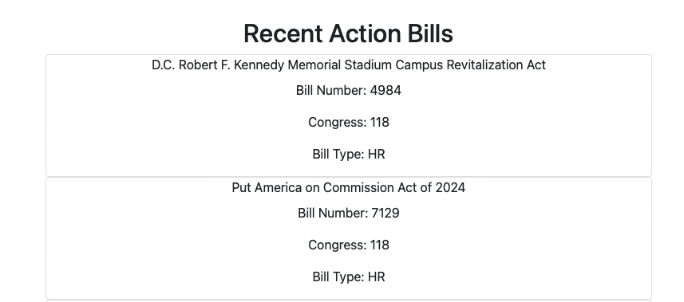
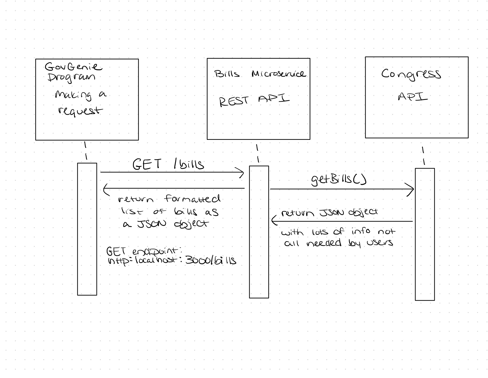

# Setup
1. Clone and open the repository 
2. Run the following to install the dependencies

    ```
    npm i package.json
    ```
3. Get an api key from https://gpo.congress.gov/sign-up/
4. Create an .env file add to the file 
    ```
    API_KEY = <REPLACE_WITH_API_KEY_FROM_CONGRESS_API>
    ``` 
3. Start microservice
    ```
    node app.js
    ```
4. Navigate to http://localhost:3000/bills/ to see the formatted data returned from the GET request. 
5. Files in the frontend directory were created to test the microservice. They can be in a different repository but added here for easy access. 

    Example Request - API Endpoint 

    Method: /GET
    
    URL: http://localhost:3000/bills/

    Sample fetch call to **request data** from the microservice:  

        async function getRecentActionBills(){
            try {
                const url = `http://localhost:3000/bills/`
                const res = await fetch(url, {
                    method: "GET", 
                    headers:{
                        "Content-Type":"application/json"
                    },
                })
                return res.json()
            }catch(error){
                return res.status(error.status).json({message: "Error retrieving bills"})
            }
        }

    Example response -  **receive data** as a JSON object:
    ```
    [
        {"congress":118,"number":"4984","title":"D.C. Robert F. Kennedy Memorial Stadium Campus Revitalization Act","type":"HR"},

        {"congress":118,"number":"1029","title":"Amending the Rules of the House of Representatives to establish a Permanent Select Committee on Aging.","type":"HRES"}
    ]
    ```
8. Open index.html with `Show in Browser` button or `Copy Path` button and paste the url in a browser. The data is requested, received and displayed on the webpage. 



# UML 

